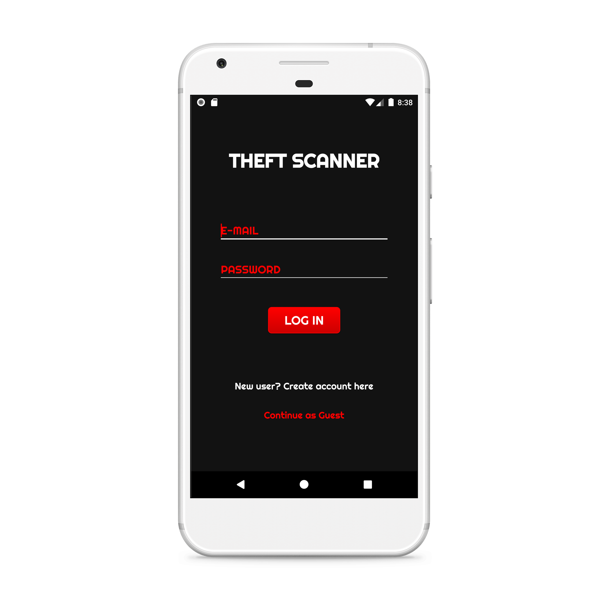
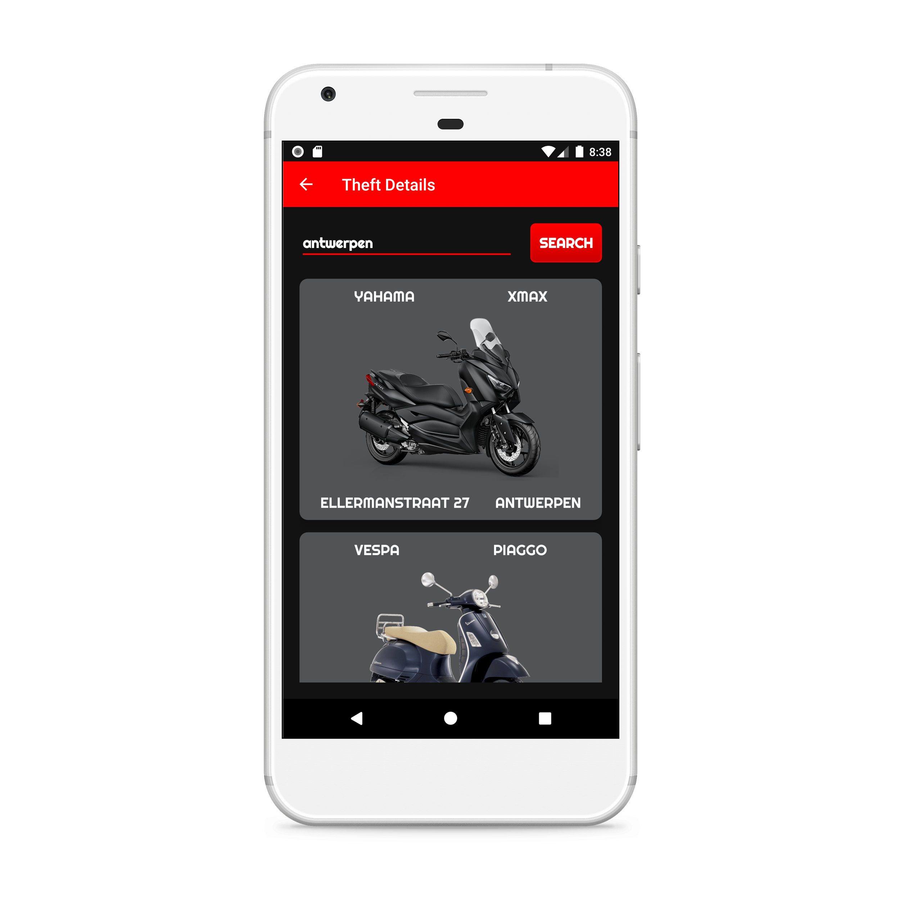
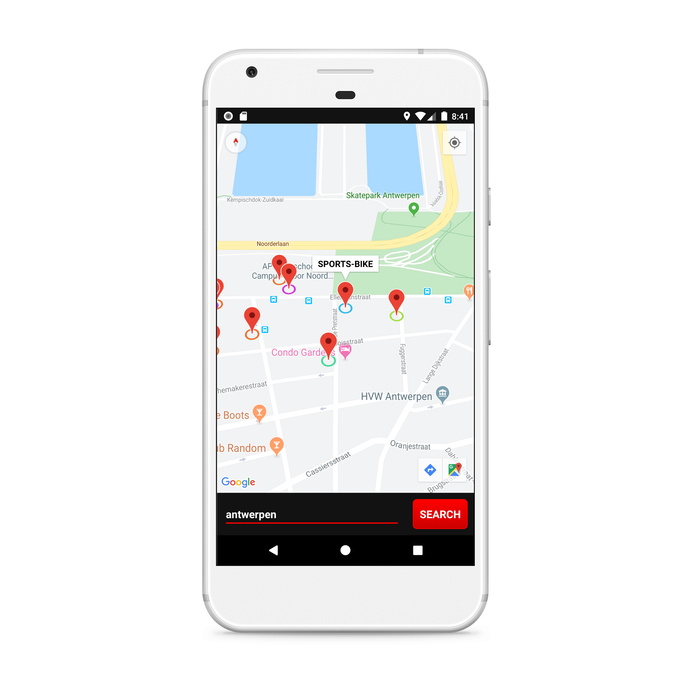
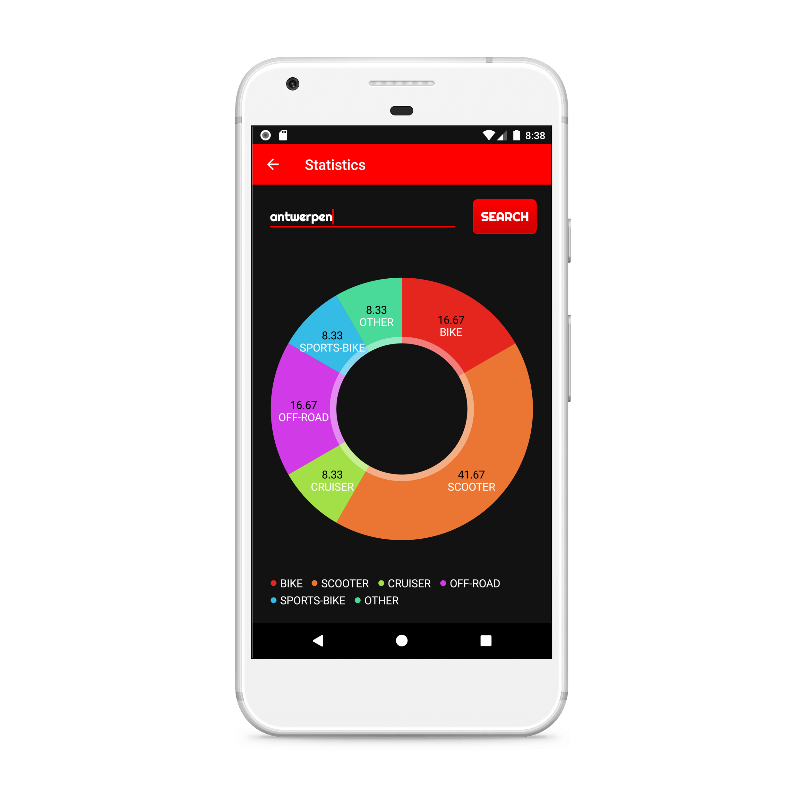

## Status 

## Getting Started
1. [Get Google Maps API Key](https://developers.google.com/maps/documentation/android-sdk/get-api-key)
2. [Add Project To Firebase](https://firebase.google.com/docs/database/android/start)

## Preview

<table >
  <tr>
    <td></td>
    <td></td>
  </tr>
  <tr>
    <td></td>
    <td></td>
  </tr>
</table>

## Install
* [Google Play](https://play.google.com/store/apps/details?id=com.mohamed.theftscanner)

